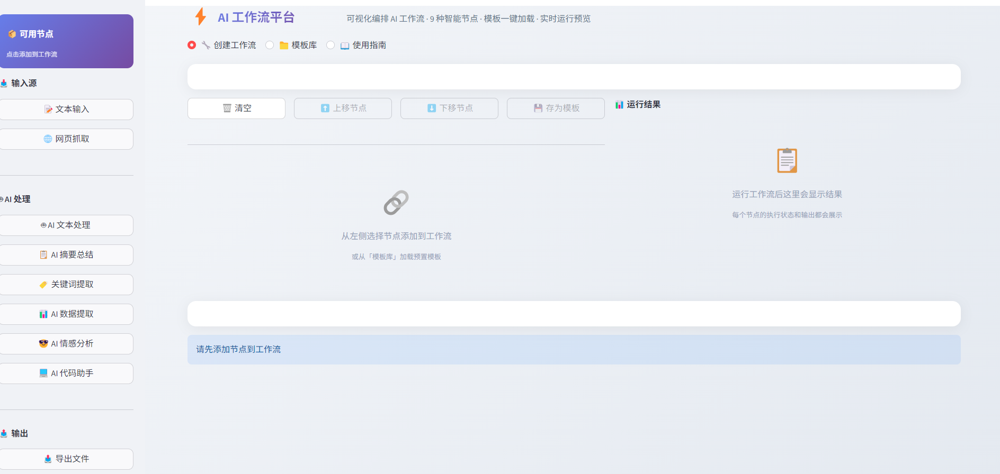
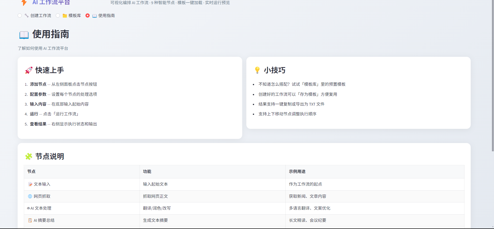
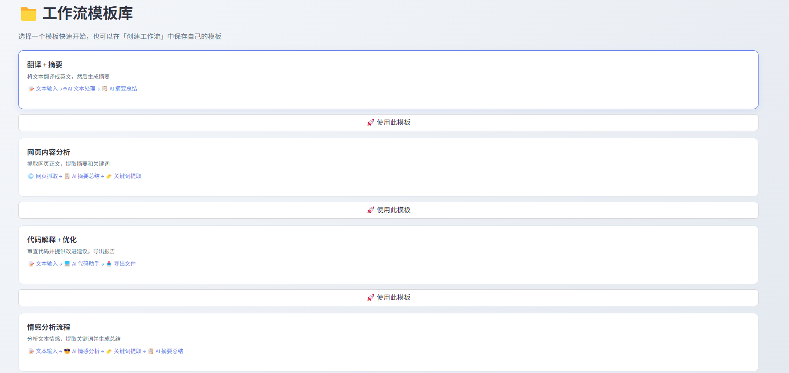

# ⚡ AI 工作流自动化平台 | AI Workflow Automation Platform

> [中文](#中文) | [English](#english)

---

<a id="中文"></a>
## 🇨🇳 中文

> 可视化、节点式的 AI 工作流编辑器。通过连接不同处理节点构建自定义 AI 流水线，设计一次、运行多次——自动完成文本生成、网页抓取、情感分析、代码生成等任务。






### 🎯 应用场景

**内容创作：**
- **翻译 + 摘要流水线** — 输入中文文章 → AI 翻译成英文 → AI 提取要点 → 导出文件
- **内容再利用** — 长文章 → 提取关键信息 → 生成社交媒体帖子 → 品牌安全检查
- **会议纪要处理** — 原始转录文本 → AI 摘要 → 提取待办事项 → 导出结构化纪要

**数据处理：**
- **网页内容分析** — URL 输入 → 抓取网页 → AI 摘要 → 提取关键词 → 情感分析
- **竞品监控** — 抓取竞品页面 → 摘要变更 → 情感分析公告 → 导出报告
- **评论分析** — 用户评论输入 → 逐条情感分析 → 提取共同关键词 → AI 趋势总结

**开发辅助：**
- **代码审查流水线** — 粘贴代码 → AI 代码审查 → AI 改进建议 → 导出标注代码
- **文档生成器** — 源代码或 API 规范 → AI 解释功能 → 生成文档 → 导出
- **多语言代码翻译** — Python 代码 → AI 翻译成 JavaScript → 导出

### 核心差异化

这是一个**无代码 AI 流水线构建器**。不需要写脚本串联多个 AI 操作，在画布上可视化连接节点即可。自研工作流引擎处理节点间的数据传递、错误处理和顺序执行。可以理解为轻量版、自托管的 Zapier/Make，专门为 AI 文本处理任务设计。

### ✨ 功能特性

- 🔧 **可视化工作流编辑器** — 添加、配置、排序、删除节点的直观 UI
- 🧩 **9 种内置节点类型** — 覆盖输入、处理、AI、输出全流程
- ▶️ **一键执行** — 运行整个工作流，查看每个节点的输出
- 📋 **模板库** — 4 个预置工作流模板
- 💾 **保存自定义模板** — 将工作流保存为可复用模板
- 📥 **导出结果** — 下载最终输出为 TXT 文件
- 📋 **一键复制** — 复制任意节点的输出到剪贴板

### 🧩 节点类型

| 分类 | 节点 | 说明 |
|------|------|------|
| **输入** | 📥 文本输入 | 用户提供的工作流起始文本 |
| **输入** | 🌐 网页抓取 | 从 URL 获取并提取文本内容 |
| **AI** | 🤖 AI 文本生成 | 通用文本生成，自定义 prompt |
| **AI** | 📝 AI 摘要 | 将长文本浓缩为简洁摘要 |
| **AI** | 🔑 AI 关键词提取 | 从文本中提取重要关键词和主题 |
| **AI** | 📊 AI 信息抽取 | 提取结构化数据（人名、日期等） |
| **AI** | 😊 AI 情感分析 | 分析文本情感倾向（正面/负面/中性） |
| **AI** | 💻 AI 代码生成 | 生成、审查或解释代码 |
| **输出** | 📄 文件导出 | 将节点输出导出为可下载的文本文件 |

### 📋 预置模板

| 模板 | 流水线 | 适用场景 |
|------|--------|----------|
| **翻译 + 摘要** | 文本输入 → AI 翻译 → AI 摘要 | 翻译文章并快速了解要点 |
| **网页内容分析** | 网页抓取 → AI 摘要 → 关键词提取 | 自动分析任意网页 |
| **代码审查 + 导出** | 文本输入 → AI 代码审查 → 文件导出 | 审查代码并保存分析结果 |
| **情感分析流程** | 文本输入 → 情感分析 → 关键词 → 摘要 | 深度分析文本情感和主题 |

### 🏗️ 系统架构

```
┌─────────────────────────────────────────────────────────────┐
│                    Streamlit Web UI                          │
│  ┌───────────┐  ┌──────────────┐  ┌──────────────────────┐ │
│  │  侧边栏   │  │   工作流     │  │   结果面板           │ │
│  │  节点面板  │  │   编辑器     │  │   (每个节点的输出)   │ │
│  └─────┬─────┘  └──────┬───────┘  └──────────┬───────────┘ │
└────────┼────────────────┼──────────────────────┼───────────┘
        │                │                      │
┌───────▼────────────────▼──────────────────────▼───────────┐
│                    工作流引擎                               │
│  ┌──────────────────────────────────────────────────────┐ │
│  │  1. 解析工作流 JSON                                   │ │
│  │  2. 按顺序排列节点                                    │ │
│  │  3. 顺序执行每个节点                                  │ │
│  │  4. 将节点 N 的输出作为节点 N+1 的输入                │ │
│  │  5. 收集所有节点的结果                                │ │
│  └──────────────────────────────────────────────────────┘ │
└───────────────────────────────────────────────────────────┘
        │                              │
        ▼                              ▼
┌───────────────┐              ┌──────────────────┐
│  节点模块      │              │  DeepSeek API    │
│  (9 个插件)    │              │  (AI 处理)       │
└───────────────┘              └──────────────────┘
```

### 🧠 工作流引擎设计

核心引擎（`workflow_engine.py`）实现了**顺序节点执行模型**：

```
节点注册表（单例模式）
  └── 每种节点类型注册：name, category, config_schema, execute()

工作流执行：
  1. 构建有序节点列表
  2. 对每个节点：
     a. 解析输入（第一个节点用用户输入，后续用上一个节点的输出）
     b. 合并节点的自定义配置（prompt 模板、参数等）
     c. 调用 node.execute(input_data, config)
     d. 存储结果（输出文本 + 元数据）
  3. 返回所有结果
```

### 📁 项目结构

```
ai-workflow-platform/
├── app.py                      # Streamlit Web 界面（主入口）
├── workflow_engine.py          # 核心工作流执行引擎
├── nodes/                      # 节点插件系统
│   ├── __init__.py             # 节点注册表 & 基类
│   ├── input_node.py           # 文本输入节点
│   ├── web_scrape_node.py      # 网页抓取节点
│   ├── ai_text_node.py         # AI 文本生成节点
│   ├── ai_summary_node.py      # AI 摘要节点
│   ├── ai_keywords_node.py     # AI 关键词提取节点
│   ├── ai_extract_node.py      # AI 信息抽取节点
│   ├── ai_sentiment_node.py    # AI 情感分析节点
│   ├── ai_code_node.py         # AI 代码生成节点
│   └── file_export_node.py     # 文件导出节点
├── requirements.txt            # Python 依赖
├── .env.example                # 环境变量模板
├── screenshots/                # UI 截图
└── 启动应用.bat                 # Windows 快速启动
```

### 🚀 快速开始

```bash
git clone https://github.com/SsllF8/ai-workflow-platform.git
cd ai-workflow-platform
python -m venv .venv && .venv\Scripts\activate   # Windows
pip install -r requirements.txt
cp .env.example .env  # 填入 DEEPSEEK_API_KEY
streamlit run app.py
```

### 📖 使用方式

**方式 A：使用模板**
1. 点击「📁 模板库」标签
2. 选择预置模板
3. 点击「使用」加载到编辑器
4. 输入文本/URL，点击「▶️ 运行工作流」

**方式 B：从头搭建**
1. 在「🔧 创建工作流」标签，用侧边栏添加节点
2. 配置每个节点的参数（prompt 模板、设置）
3. 用 ⬆️/⬇️ 按钮排序节点
4. 输入文本，点击「▶️ 运行工作流」
5. 在结果面板查看每个节点的输出
6. 可选：保存为自定义模板

### ⚙️ 环境变量配置

| 变量名 | 必填 | 说明 |
|--------|------|------|
| `DEEPSEEK_API_KEY` | ✅ | DeepSeek API 密钥 |

### 🛠️ 技术栈

| 组件 | 技术 | 用途 |
|------|------|------|
| Web 框架 | Streamlit | 交互式工作流编辑器 UI |
| AI | DeepSeek API | 文本处理、分析、生成 |
| 网页抓取 | Requests + BeautifulSoup | 获取和解析网页内容 |
| 工作流引擎 | 自研 Python | 节点注册、执行流水线、数据传递 |
| 插件系统 | 自研 Python | 可扩展的节点架构，自动注册 |

### 🔧 扩展自定义节点

平台使用基于插件的节点系统。添加新节点类型：

```python
# nodes/my_custom_node.py
from nodes import BaseNode, NodeResult, register_node

class MyCustomNode(BaseNode):
    name = "My Custom Node"
    category = "AI"
    description = "做一些自定义处理"
    
    def get_config_schema(self):
        return {"param1": {"type": "text", "label": "参数"}}
    
    def execute(self, input_data, config):
        result = process(input_data, config["param1"])
        return NodeResult(success=True, output=result)

register_node(MyCustomNode)
```

然后在 `app.py` 中导入即可注册：
```python
import nodes.my_custom_node
```

### 💡 面试要点 / Interview Talking Points

**1. 工作流引擎的设计模式？**
- **策略模式**：每个节点是一个策略，通过统一的 `execute()` 接口调用
- **注册表模式**：节点通过 `register_node()` 自动注册到全局注册表，引擎运行时按需查找
- **管道模式**：节点顺序执行，上一个的输出作为下一个的输入

**2. 为什么不直接用 LangChain Chain？**
- LangChain Chain 是线性的，节点类型固定
- 自研引擎支持**任意节点组合**和**自定义配置**
- 展示了系统设计能力，不只是调库

**3. 插件系统怎么实现自动注册的？**
- 利用 Python 的**模块导入副作用**：`import nodes.xxx` 时，模块底层的 `register_node()` 自动执行
- 注册表是全局字典 `{node_name: node_class}`，引擎执行时按名称查找
- 类似于 Flask 的 `@app.route()` 装饰器注册

**4. 这个项目和市面上的 n8n / Dify 的区别？**
- n8n/Dify 是成熟的商业级产品，功能全面但部署复杂
- 本项目展示了核心原理，代码量小、易理解
- 适合面试讲解：能说清楚工作流引擎的设计思路

### ⚠️ 搭建中可能遇到的问题 / Troubleshooting

| 问题 | 原因 | 解决方案 |
|------|------|----------|
| 节点执行失败但不报错 | 某个节点返回了 NodeResult(success=False) | 在引擎中增加错误传播和用户提示 |
| 网页抓取超时 | 目标网站响应慢或反爬 | 增加 timeout 参数，考虑加 User-Agent 头 |
| Streamlit 页面刷新丢失工作流 | Streamlit rerun 清空状态 | 用 `st.session_state` 持久化工作流 JSON |
| 节点配置不生效 | 配置 schema 和实际使用不一致 | 检查 config_schema 定义的字段名是否和 execute 中一致 |
| 自定义节点不显示 | 没有在 `__init__.py` 或 `app.py` 中导入 | 确保模块被导入，`register_node()` 被调用 |
| 多个 AI 节点串行很慢 | 每个节点单独调用 API | 可优化为批量请求或并行执行无依赖节点 |

### 🚀 扩展方向 / Future Enhancements

- **并行执行** — 对无依赖关系的节点并行执行，提升速度
- **条件分支** — 支持 if/else 逻辑节点（如：情感为负面 → 触发告警）
- **循环节点** — 支持 for-each 循环（如：对列表中每条评论做分析）
- **变量系统** — 节点间传递结构化数据（不只是纯文本），支持变量引用
- **可视化连线** — 拖拽式连线界面，更直观地展示数据流向
- **版本控制** — 工作流的历史版本对比和回滚
- **定时执行** — 类似 Cron，定时运行指定工作流
- **API 触发** — 提供 HTTP 接口，外部系统可以触发工作流执行
- **数据库节点** — 读写 MySQL/PostgreSQL，实现数据持久化流水线

---

<a id="english"></a>
## 🇬🇧 English

> A visual, node-based AI workflow editor that lets you build custom AI pipelines by connecting different processing nodes. Design once, run many times — automate text generation, web scraping, sentiment analysis, code generation, and more.

### Use Cases

**Content Creation:**
- **Translation + Summarization Pipeline** — Input Chinese article → AI translates to English → AI summarizes key points → Export
- **Content Repurposing** — Long article → Extract key info → Generate social posts → Sentiment check
- **Meeting Notes Processing** — Raw transcript → AI summary → Extract action items → Export minutes

**Data Processing:**
- **Web Content Analysis** — URL → Scrape → AI summary → Keyword extraction → Sentiment analysis
- **Competitor Monitoring** — Scrape pages → Summarize changes → Sentiment analysis → Export report
- **Review Analysis** — Customer reviews → Per-review sentiment → Common keywords → AI trend summary

### Key Differentiator

A **no-code AI pipeline builder**. Instead of writing scripts to chain AI operations, visually connect nodes. The custom workflow engine handles data passing, error handling, and sequential execution. Think of it as a lightweight, self-hosted alternative to Zapier/Make for AI text processing.

### Features

- 🔧 **Visual Workflow Editor** — Add, configure, reorder, and delete nodes
- 🧩 **9 Built-in Node Types** — Input, processing, AI, and output operations
- ▶️ **One-Click Execution** — Run the entire workflow and see per-node results
- 📋 **Template Library** — 4 pre-built templates
- 💾 **Save Custom Templates** — Save workflows for reuse
- 📥 **Export Results** — Download final output as TXT

### Node Types

| Category | Node | Description |
|----------|------|-------------|
| **Input** | 📥 Text Input | User-provided text as starting point |
| **Input** | 🌐 Web Scrape | Fetch and extract text from a URL |
| **AI** | 🤖 AI Text Generation | General-purpose text generation |
| **AI** | 📝 AI Summary | Condense text into concise summary |
| **AI** | 🔑 AI Keyword Extraction | Extract important keywords |
| **AI** | 📊 AI Information Extraction | Extract structured data |
| **AI** | 😊 AI Sentiment Analysis | Analyze emotional tone |
| **AI** | 💻 AI Code Generation | Generate, review, or explain code |
| **Output** | 📄 File Export | Export output to downloadable text file |

### Architecture

```
┌─────────────────────────────────────────────────────────────┐
│                    Streamlit Web UI                          │
│  ┌───────────┐  ┌──────────────┐  ┌──────────────────────┐ │
│  │  Sidebar  │  │   Workflow   │  │   Results Panel      │ │
│  │  Node     │  │   Editor     │  │   (per-node output)  │ │
│  │  Palette  │  │   + Config   │  │                      │  │
│  └─────┬─────┘  └──────┬───────┘  └──────────┬───────────┘ │
└────────┼────────────────┼──────────────────────┼───────────┘
        │                │                      │
┌───────▼────────────────▼──────────────────────▼───────────┐
│                    Workflow Engine                          │
│  1. Parse workflow JSON                                    │
│  2. Sort nodes sequentially                                │
│  3. Execute each node                                      │
│  4. Pass output of node N as input to node N+1            │
│  5. Collect all results                                    │
└───────────────────────────────────────────────────────────┘
```

### Quick Start

```bash
git clone https://github.com/SsllF8/ai-workflow-platform.git
cd ai-workflow-platform
python -m venv .venv && .venv\Scripts\activate   # Windows
pip install -r requirements.txt
cp .env.example .env  # Fill in your DEEPSEEK_API_KEY
streamlit run app.py
```

### Interview Talking Points

**1. Design patterns in the workflow engine?**
- **Strategy Pattern**: Each node is a strategy with unified `execute()` interface
- **Registry Pattern**: Nodes auto-register via `register_node()` into global registry
- **Pipeline Pattern**: Sequential execution, node N output → node N+1 input

**2. Why not just use LangChain Chain?**
- LangChain Chain is linear with fixed node types
- Custom engine supports **arbitrary node combinations** and **custom configs**
- Demonstrates system design skills, not just library usage

**3. How does the plugin system auto-register?**
- Python's **module import side effects**: `import nodes.xxx` triggers `register_node()`
- Registry is a global dict `{node_name: node_class}`, engine looks up by name
- Similar to Flask's `@app.route()` decorator pattern

**4. How does this compare to n8n/Dify?**
- n8n/Dify are mature commercial products with complex deployment
- This project demonstrates core principles with minimal, readable code
- Great for interviews: can explain workflow engine design clearly

### Troubleshooting

| Issue | Cause | Solution |
|-------|-------|----------|
| Node fails silently | Node returns NodeResult(success=False) | Add error propagation and user notification |
| Web scrape timeout | Slow site or anti-scraping | Increase timeout, add User-Agent header |
| Workflow lost on refresh | Streamlit rerun clears state | Use `st.session_state` to persist workflow JSON |
| Config not applied | Schema vs usage mismatch | Check field names match between schema and execute() |
| Custom node not showing | Not imported in app.py | Ensure module is imported, register_node() is called |
| Slow serial AI nodes | Each node makes separate API call | Batch requests or parallelize independent nodes |

### Future Enhancements

- **Parallel Execution** — Run independent nodes concurrently
- **Conditional Branching** — If/else logic nodes (e.g., negative sentiment → trigger alert)
- **Loop Nodes** — For-each iteration (e.g., analyze each review in a list)
- **Variable System** — Pass structured data between nodes, support variable references
- **Visual Connections** — Drag-and-drop wire UI for data flow visualization
- **Version Control** — Workflow history comparison and rollback
- **Scheduled Execution** — Cron-like scheduled workflow runs
- **API Triggers** — HTTP endpoints for external system integration
- **Database Nodes** — MySQL/PostgreSQL read/write for data persistence pipelines

## 📄 License

This project is licensed under the MIT License.
